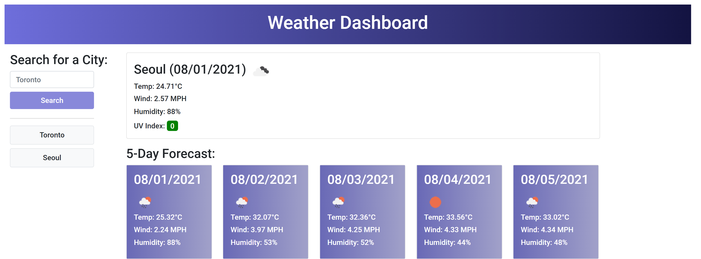

# weather-dashboard

## Description 
- to create a weather dashboard with form inputs
- to present with current and future conditions for that city and that city is added to the search history
- to view current weather conditions for that city, including the city name, the date, an icon representation of weather conditions, the temperature, the humidity, the wind speed, and the UV index & a color that indicates whether the UV conditions are favorable, moderate, or severe
- to also view a 5-day forecast that displays the date, an icon representation of weather conditions, the temperature, the wind speed, and the humidity
- to click on a city in the search history to view with current and future conditions for that city

## Link to deployed application 
https://jessibewu.github.io/weather-dashboard/

## Usage 
Below is a screenshot of the application: 

 

## Credits: 
https://courses.bootcampspot.com/

## License: 
Licensed under the MIT license.
